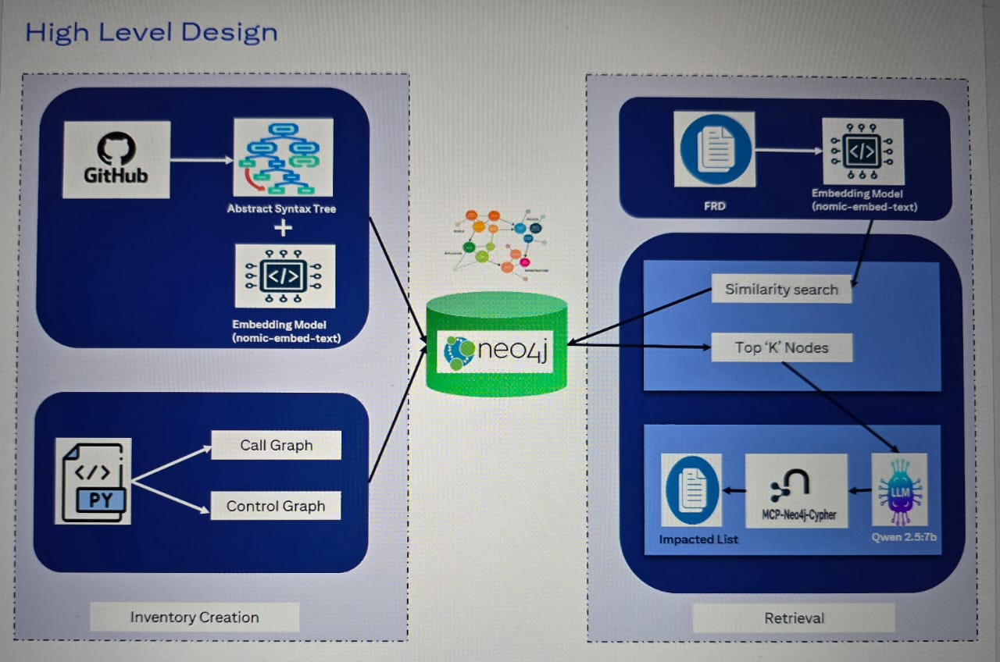

# Citi Impact Analysis Platform

This project is a proof of concept built for the Citi Impact Analysis
Hackathon. It performs automated impact analysis for functional
requirements by combining Code RAG, Graph RAG, Neo4j, and LLM powered
reasoning.

## Overview

This platform analyzes an uploaded functional requirement document and
identifies the related code modules, services, and dependencies. It uses
a graph based retrieval approach to ensure deep and accurate impact
analysis across the system.

The workflow is as follows: 1. The functional requirement (FR) is
uploaded. 2. The system extracts key concepts and generates embeddings
using the nomic embed text model. 3. A Graph RAG pipeline queries the
Neo4j graph to fetch related modules, services, dependencies, and code
level connections. 4. These results are passed into the LLM. 5. The LLM,
powered by llama 3.1 8b, generates a detailed impact analysis showing
affected components and risk areas.

The solution uses MCP for secure model interaction and an internal code
based RAG workflow.

[Demo Video](https://drive.google.com/file/d/1eIXG9_lypGusqArNAVVO18ibotoO06nb/view?usp=sharing)

## Architecture Diagram

## Tech Stack

-   LLM: llama 3.1 8b
-   Embeddings: nomic embed text
-   Graph Database: Neo4j
-   Retrieval Method: Graph RAG plus Code RAG
-   Local Models Runtime: Ollama
-   Backend Services: Docker based microservices
-   MCP: For structured model interaction

## Prerequisites

-   Docker and Docker Compose must be installed.
-   The first startup using Ollama may take time because the llama 3.1
    8b model and the nomic embed model need to be pulled locally. This
    is expected during the initial run.

## Running the Platform

To start the application:

    docker compose up -d --build

Access the interface at:

    http://localhost:8090

Ollama may take several minutes during the first run as it pulls the
required models.

## Features

-   Upload FR documents for analysis
-   Retrieve related modules using Code RAG with Graph RAG
-   Neo4j powered semantic and structural search
-   Deep impact analysis powered by llama 3.1 8b
-   Automatic graph based dependency tracking
-   Local LLM and embeddings for secure internal processing
